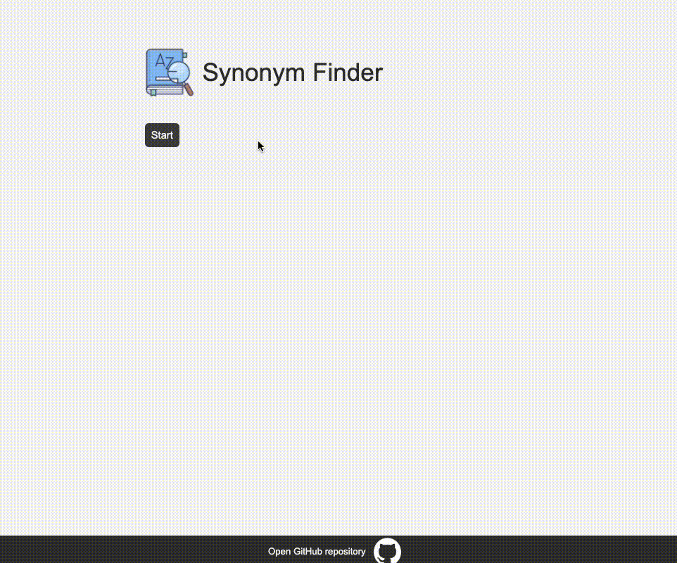

# ThesaurusMatch

ThesaurusMatch is a Vanilla JS application that was created to implement JS fundamentals like traversing the DOM, manipulating styles, event handling and asynchronous functions.
It randomly selects a word from a thesaurus database and prompts the user to enter a synonym for that word. When that word is submitted, it compares the user input to the array of synonyms available in the dataset for that particular word, and displays a message indicating whether a match was found.

## Demo

## Database sources

I utilized my own database in this application, which is a result of refining and filtering an English thesaurus dataset through a Python script. The first layer of validation aims to filter out common first and last names, country codes, names of countries and cities, as well as words deemed inappropriate or offensive. A second filter is then applied based on word frequency.
Please note that the dataset may still contain inappropriate words, as well as incorrect synonyms and words that have fallen out of use.

Sources:

- English thesaurus [link](https://github.com/zaibacu/thesaurus)
- English word frequency [link](https://www.kaggle.com/datasets/rtatman/english-word-frequency)
- Database of bad words [link](https://www.kaggle.com/datasets/nicapotato/bad-bad-words)

### How to Run the Program

To run this program, you will need to use VS Code and the Live Server extension, or a similar setup. Clone this repository into your local machine. Open the folder with VS Code, open the `index.html` file and use the Live Server extension to launch the application in your browser.
